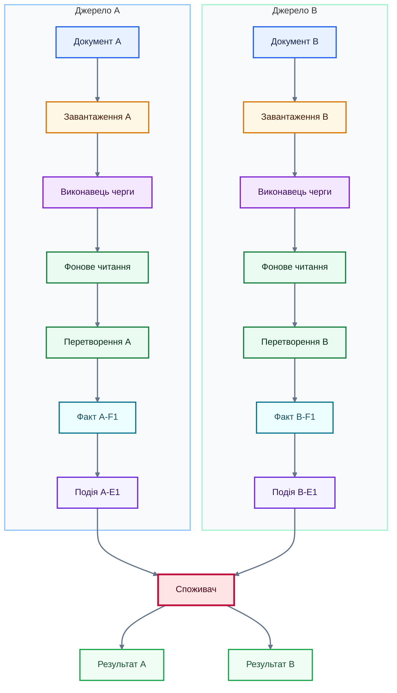
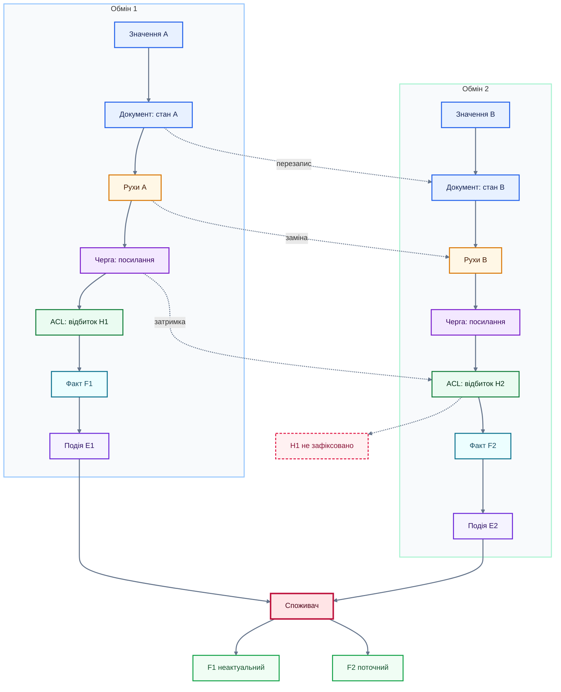

# Verified Mermaid patterns for Interstarch YouTrack

These patterns use syntax and visual conventions successfully rendered in `interstarch.youtrack.cloud`. Adapt identifiers and labels to the article. Do not copy illustrative domain values as facts unless the user supplied them.

## Pattern 1: two source lanes converging on one consumer

Use when two independent operations or regional sources pass through equivalent stages and converge on a shared component.



Follow it with a detail table:

| Потік | Вхід | Перетворення | Канонічний факт | Результат |
| --- | --- | --- | --- | --- |
| A | Exact example fields | What the adapter reads | Key fact fields | Consumer output |
| B | Exact example fields | What the adapter reads | Key fact fields | Consumer output |

## Pattern 2: the same entity across two exchanges

Use when a mutable 1C document and its movements are overwritten by a later exchange. Keep the normal paths solid and cross-version effects dashed.



State in prose what the dashed delayed path means. In particular, do not let a dashed annotation imply that data loss occurs on the normal path.

## Compact palette block

Copy only the classes used by a chart:

```text
classDef source fill:#E8F1FF,stroke:#2563EB,color:#172554,stroke-width:2px
classDef loading fill:#FFF7E6,stroke:#D97706,color:#451A03,stroke-width:2px
classDef queue fill:#F3E8FF,stroke:#7E22CE,color:#3B0764,stroke-width:2px
classDef transform fill:#EAFBF1,stroke:#15803D,color:#052E16,stroke-width:2px
classDef fact fill:#ECFEFF,stroke:#0E7490,color:#164E63,stroke-width:2px
classDef event fill:#F5F3FF,stroke:#6D28D9,color:#2E1065,stroke-width:2px
classDef consumer fill:#FFE4E6,stroke:#BE123C,color:#4C0519,stroke-width:3px
classDef result fill:#F0FDF4,stroke:#16A34A,color:#14532D,stroke-width:2px
classDef warning fill:#FFF1F2,stroke:#E11D48,color:#881337,stroke-width:2px,stroke-dasharray:5 3
linkStyle default stroke:#64748B,stroke-width:2px
```

## Failure patterns to avoid

- HTML line breaks in labels: YouTrack may strip them and concatenate all text.
- Full payloads inside nodes: boxes grow, text clips, and the process becomes unreadable.
- One color for every role: readers cannot scan boundaries.
- Different colors for the same role in adjacent diagrams: the visual vocabulary becomes misleading.
- Very long edge labels: they cross nodes and other connectors.
- A single chart mixing independent entities, revisions, retries, and quarantine: split by question.
- Claiming visual success after only reading article Markdown: inspect the rendered page.
